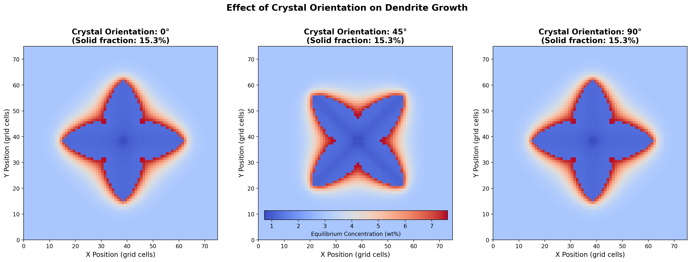

# 2D Dendrite Growth Composition Model

[](https://www.python.org/downloads/)
[](https://opensource.org/licenses/MIT)

A computational model for simulating dendrite growth during solidification with solute transport using cellular automata methods.


*Dendrite growth patterns at different crystal orientations (0°, 45°, 90°)*

## Overview

This project simulates the formation and evolution of dendritic microstructures during alloy solidification. The model captures:

- 🌲 **Dendritic growth** - Tree-like crystal structures formation
- 🔄 **Solute redistribution** - Alloying element partitioning
- 📐 **Crystallographic anisotropy** - Directional growth preferences
- 🌡️ **Curvature effects** - Gibbs-Thomson boundary conditions

### Applications
- Casting process optimization
- Additive manufacturing
- Material microstructure prediction
- Solidification research

## Installation

### Prerequisites
- Python 3.7+
- pip package manager

### Quick Setup

```bash
# Clone the repository
git clone https://github.com/jaavedakram/DendriteModel.git
cd DendriteModel

# Create virtual environment
python3 -m venv mcenv
source mcenv/bin/activate  # On Linux/Mac
# or: mcenv\Scripts\activate  # On Windows

# Install dependencies
pip install -r requirements.txt
```

## Running the Simulation

### Basic Usage

```bash
# Activate virtual environment
source mcenv/bin/activate

# Run simulation
python Terminal2DCompositionModel.py
```

**Output:**
- `dendrite_result.png` - Composition field visualization
- Terminal statistics - Numerical results

### Expected Results
```
Simulation Complete!
Final Results:
  Total solid cells: 861 / 5625 (15.3%)
  Average fraction solid: 0.171
  Simulation time: 3.2e-03 s
```

### Crystal Orientation Comparison

Compare different orientations:
```bash
python run_crystal_comparison.py
```

Generates comparison plots for 0°, 45°, and 90° crystal orientations.

### Run Examples

Explore parameter effects:
```bash
python run_examples.py
```

Generates examples showing effects of:
- Crystal orientation
- Undercooling
- Anisotropy strength
- Domain size

## Configuration

Edit `simulation_config.py` to customize parameters:

```python
class DefaultConfig:
    domain.sizex = 75              # Grid size
    domain.sizey = 75
    time.num_steps = 400           # Simulation steps
    nucleation.crystal_angle = 0   # Crystal orientation (degrees)
    physical.undercooling = 15     # Driving force (K)
```

Material properties in `Materials_Constants.json`:
```json
{
    "C0": 3,        // Initial concentration (wt%)
    "P_C": 0.17,    // Partition coefficient
    "ml": -3.36     // Liquidus slope (K/wt%)
}
```

## Documentation

📚 **Detailed documentation available in the [Wiki](../../wiki)**:
- [Theory & Governing Equations](../../wiki/Theory)
- [Configuration Guide](../../wiki/Configuration)
- [Examples & Tutorials](../../wiki/Examples)
- [Troubleshooting](../../wiki/Troubleshooting)

## Project Structure

```
DendriteModel/
├── Terminal2DCompositionModel.py   # Main simulation script
├── simulation_engine.py             # Core simulation logic
├── simulation_config.py             # Configuration presets
├── Variables.py                     # Field initialization
├── GrainBoundary.py                 # Interface detection
├── GeometricFactor.py               # Geometric calculations
├── NormalAngle.py                   # Normal vector calculation
├── SoluteTransport.py               # Diffusion solver
├── FractionSolidComposition.py      # Solidification kinetics
└── Materials_Constants.json         # Material properties
```

## Quick Reference

| Parameter | Default | Description |
|-----------|---------|-------------|
| `sizex/y` | 75 | Grid dimensions |
| `num_steps` | 400 | Simulation iterations |
| `crystal_angle` | 0° | Crystal orientation |
| `undercooling` | 15 K | Driving force |

## Citation

If you use this code in your research, please cite:

```bibtex
@software{dendrite_model_2024,
  title={2D Dendrite Growth Composition Model},
  author={Akram, Javed},
  year={2024},
  url={https://github.com/jaavedakram/DendriteModel}
}
```

### Reference
> M.F. Zhu, S.Y. Lee, C.P. Hong, "Modified cellular automaton model for the prediction of dendritic growth with melt convection," *Phys. Rev. E* **69** (2004) 061610. [doi:10.1103/PhysRevE.69.061610](https://doi.org/10.1103/PhysRevE.69.061610)

## License

MIT License - see [LICENSE](LICENSE) file for details.

## Contact

**Javed Akram**
📧 jaavedakram@gmail.com
🔗 [GitHub Issues](https://github.com/jaavedakram/DendriteModel/issues)

---

⭐ Star this repo if you find it useful!
